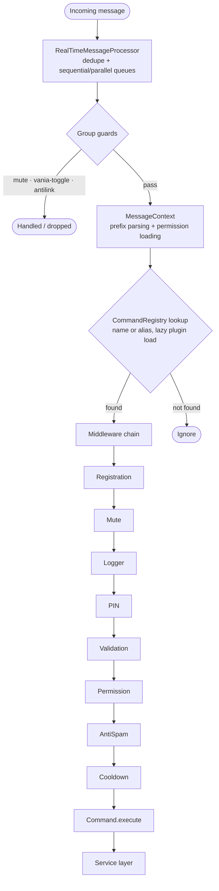
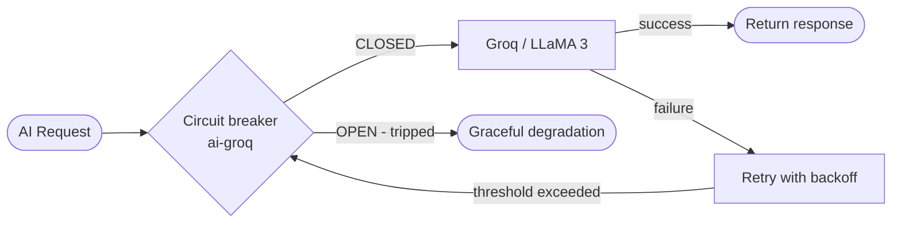
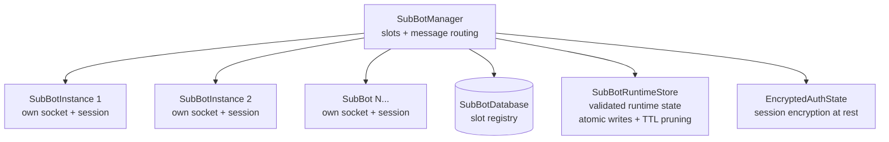
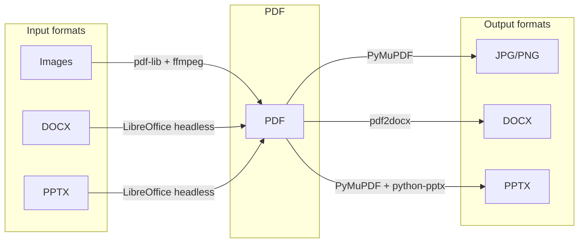

# VaniaBot

A production-grade WhatsApp automation system built with TypeScript — featuring 300+ commands across 15 categories, 20 service modules, a middleware pipeline that every message traverses, multi-instance SubBot orchestration, and a test suite of ~1000 unit and end-to-end tests that run in CI.

[](https://www.typescriptlang.org/)
[](https://nodejs.org/)
[](LICENSE)

---

## Why this project exists (and what makes it interesting)

Most WhatsApp bots are a `switch/case` on a message string. VaniaBot started the same way — and became unmaintainable at around 20 commands. This project is the result of rethinking the entire architecture to be modular, resilient, and scalable without rewriting core logic every time something breaks or a new feature is added.

The interesting engineering problems solved here:

- **How do you manage dozens of concurrent WhatsApp sessions** without memory leaks or session corruption?
- **What happens when your AI provider goes down** mid-conversation? How do you fail gracefully without the user noticing?
- **How do you build a command system** where adding a new command never touches existing logic — and where two commands can never silently shadow each other?

The sections below explain each of these in detail.

---

## Architecture

### Core Design: Middleware Pipeline + Command Registry

Instead of a monolithic message handler, every incoming message passes through a supervisor (`vania.ts` keeps the bot process alive), an event bus, and a sequential middleware chain before reaching a command. Cross-cutting concerns (registration, permissions, anti-spam, cooldowns) are completely decoupled from business logic.



**The key benefit:** adding a new command means creating one file. The `PluginLoader` discovers and registers it automatically at startup (lazy-loading non-critical categories), and a static uniqueness test guarantees that no two commands ever collide on a name or an alias — so no command can silently shadow another.

**Resilient lifecycle:** the bot process is supervised — crashes restart with backoff, flood-limit restart storms, and the renderer (tsx) reports "ready" over IPC only after a real WhatsApp handshake.

---

### Resilience: Circuit Breaker Around the AI Provider

VaniaBot uses Groq (LLaMA 3) as its AI provider. The problem: external APIs fail. Instead of surfacing errors to users, every AI call runs through a circuit breaker with structured fallbacks.



The breaker tracks failure rate over a time window; after a threshold it opens and stops sending requests — protecting against cascading failures and rate-limit exhaustion — then probes half-open to recover automatically. When no API key is configured, the AI features degrade elegantly ("not configured") instead of crashing the command.

---

### Multi-Instance: SubBot Orchestration

The SubBot system runs multiple parallel WhatsApp sessions from a single process, each with its own socket, isolated state, and lifecycle — managed by `SubBotManager`.



Each instance reconnects independently with backoff (shared disconnect policy with the main bot). Runtime state survives restarts: `SubBotRuntimeStore` validates every entry on load (id mismatch, TTL, malformed data are discarded), prunes expired slots, and writes atomically (tmp + rename). Sessions are encrypted on disk via `EncryptedAuthState`.

---

### Document Pipeline: Bidirectional Conversion Bridge

Most WhatsApp bots that "convert files" only go one direction (usually _something_ → PDF) using a single engine for everything. VaniaBot's converter is bidirectional and picks a different engine per format, because forcing every conversion through the same tool (typically LibreOffice) produces visibly worse output for some formats than others.



**Engine selection per conversion:**

| Conversion      | Engine                     | Why                                                                                                      |
| --------------- | -------------------------- | -------------------------------------------------------------------------------------------------------- |
| Image → PDF     | ffmpeg + pdf-lib (pure JS) | No heavyweight subprocess needed                                                                         |
| PDF → Image     | PyMuPDF (fitz)             | Native page rendering, fast                                                                              |
| DOCX/PPTX → PDF | LibreOffice headless       | Only engine that preserves real Office fidelity                                                          |
| PDF → DOCX      | `pdf2docx` (PyMuPDF-based) | Reconstructs editable text/tables far better than LibreOffice                                            |
| PDF → PPTX      | PyMuPDF + `python-pptx`    | Renders pages as slide images — pragmatic fallback where no reliable slide-reconstruction library exists |

**Node ↔ Python contract:** rather than treating the Python bridge as a black box that returns success/failure, the bridge script communicates structured results back over stdout (`OK:<count>:<type>`) and uses semantic exit codes:

| Exit code | Meaning                                               |
| --------- | ----------------------------------------------------- |
| `0`       | Success                                               |
| `1`       | Generic failure                                       |
| `2`       | Scanned PDF — no extractable text (blocks `pdf2docx`) |
| `3`       | Page count exceeds limit                              |

Node parses these into typed errors (`ScannedPdfError`, `TooManyPagesError`) that each command surfaces as a specific, actionable message instead of a generic failure.

**Graceful degradation, not silent failure:** when a conversion can't be perfect, the bot says so — a scanned PDF gets a clear "no extractable text" reply instead of an empty DOCX, and `pdf2ppt` output is explicitly labeled as image-based, non-editable slides.

**Media grouping for `img2pdf`:** WhatsApp delivers multi-image sends as separate messages with no native grouping. `MediaGroupBuffer` debounces incoming images per `chat:sender` (settle window + max wait), deduplicates by message ID, and only then triggers conversion — turning "send 5 photos, then the command" into one PDF instead of five.

---

### Web Panel

An optional Express 5 panel (`PanelServer`) exposes health metrics and webhook routes. Disabled with `PANEL_DISABLED=true`, port configurable via `PANEL_PORT` (default `3000`), with rate limiting and helmet by default. Health reporting is centralized in `HealthCheckService` (session, memory, message stats) with an auto-restart watchdog.

---

## Tech Stack

| Layer              | Technology                       | Why                                            |
| ------------------ | -------------------------------- | ---------------------------------------------- |
| Language           | TypeScript 5 (ESM)               | Type safety across the whole codebase          |
| Runtime            | Node.js 20+                      |                                                |
| WhatsApp           | Baileys v7                       | Low-level WA Web multi-device protocol         |
| AI                 | Groq SDK (LLaMA 3)               | Circuit-breaker protected provider             |
| Primary DB         | SQLite (sql.js)                  | Zero-config repositories layer                 |
| Alternative DB     | JSON stores / MongoDB            | `DB_TYPE` switchable adapters                  |
| Cache              | In-memory LRU · Redis (optional) | Rate limiting, dedupe, AI response cache       |
| Panel / webhooks   | Express 5 + helmet + cors        | Metrics and integration endpoints              |
| Document rendering | PyMuPDF (fitz)                   | PDF page rendering, text extraction            |
| Office conversion  | LibreOffice headless             | DOCX/PPTX ↔ PDF fidelity                       |
| PDF → DOCX         | `pdf2docx`                       | Editable text/table reconstruction             |
| PDF → PPTX         | `python-pptx`                    | Slide generation from rendered pages           |
| Image → PDF        | pdf-lib + ffmpeg                 | Lightweight, no subprocess for common formats  |
| Logging            | Pino                             | Structured, low-overhead logging               |
| Validation         | Zod                              | Runtime schema validation of env + config      |
| Testing            | Vitest                           | ~1000 unit + end-to-end tests                  |
| Containers         | Docker + Compose                 | Multi-stage builds, CI-published images        |

---

## Project Structure

```
VaniaBot/
├── src/
│   ├── vania.ts                # Supervisor: spawns the bot, IPC "ready", restart backoff
│   ├── index.ts                # Entry point: database → client → panel
│   │
│   ├── commands/               # One file per command, auto-registered (15 categories)
│   │   ├── admin/              #   moderation (kick, warn, mutelist...)
│   │   ├── anime/              #   ~70 reaction commands (data-driven)
│   │   ├── creative/           #   poetry suite, canvas (quote cards...)
│   │   ├── economy/            #   lottery, loans, black market, shop, ranking
│   │   ├── fun/ games/ game/   #   truth-or-dare, flirting, RPG...
│   │   ├── media/              #   sticker, downloads, converters
│   │   ├── owner/              #   broadcast, backups, subbot admin, system
│   │   ├── utility/            #   ping, status, polls, translators, profile
│   │   └── ia/ nsfw/ interaction/ group/ rpg/
│   │
│   ├── core/                   # Client bootstrap and message machinery
│   │   ├── Client.ts           #   WhatsAppClient: wiring + lifecycle
│   │   ├── AuthManager.ts      #   session/QR/pairing, reconnect policy, ping
│   │   ├── MainMessagePipeline.ts  # guards, rate limits, command resolution
│   │   ├── MessageContext.ts   #   per-message typed context
│   │   ├── CommandRegistry.ts  #   name/alias maps + lazy plugin resolution
│   │   ├── PluginLoader.ts     #   auto-discovery of command files
│   │   ├── RealTimeMessageProcessor.ts  # dedupe + sequential/parallel queues
│   │   ├── MediaGroupBuffer.ts #   debounced multi-image grouping for img2pdf
│   │   └── WASocketFactory.ts  #   single source of truth for Baileys options
│   │
│   ├── middlewares/            # 9 chained middlewares (registration → cooldown)
│   ├── services/               # 20 modules (see below)
│   │   ├── subbot/             #   SubBotManager, EncryptedAuthState, RuntimeStore
│   │   ├── convert/            #   ConversionService, PythonBridge, scripts/bridge.py
│   │   ├── system/             #   circuit breaker, health, anti-spam, persistence
│   │   └── ...                 #   economy, moderation, media, translator, rpg...
│   ├── handlers/               # reactions, audio responses, AI mentions, quiz
│   ├── repositories/           # data access over the SQLite engine
│   ├── config/                 # zod-validated environment
│   ├── types/                  # shared TypeScript types
│   └── utils/                  # prefix matching, caching, logger, helpers
│
├── tests/                      # Vitest: unit + e2e (harness with FakeWASocket)
├── .github/workflows/          # CI: build, lint, typecheck, test, e2e, docker
├── docker-compose.yml
└── package.json
```

---

## Getting Started

### Requirements

- Node.js 20+
- A WhatsApp account for the bot
- FFmpeg, Python 3 and LibreOffice (document/media commands)
- A [Groq API key](https://console.groq.com/keys) (free tier available — optional, for AI features)

### Quick start (script)

```bash
curl -fsSL https://gist.githubusercontent.com/CARLOSGRCIAGRCIA/f94438ffa4dbdca2011771238def3532/raw/VaniaBot.sh | bash -s <version>
```

Installs Node.js, FFmpeg, clones the repo, installs dependencies, and starts the bot with a pairing code. You'll need to create a `.env` file with your credentials (see Configuration below).

### Docker (recommended for production)

```bash
# Create required directories
mkdir -p vaniasession subbots data temp

# Configure environment
cp .env.example .env
nano .env

# Start
docker-compose up -d

# Logs
docker-compose logs -f
```

Images are built and published automatically by CI on every push to `main` (tagged `latest`, full version, and major/minor).

### Local development

```bash
git clone https://github.com/CARLOSGRCIAGRCIA/VaniaBot.git
cd VaniaBot
npm install
cp .env.example .env
npm run dev    # hot-reload
```

Useful scripts:

| Script                 | What it does                                  |
| ---------------------- | --------------------------------------------- |
| `npm start`            | Supervisor + bot (interactive auth menu)      |
| `npm run qr` / `npm run code` | start with QR or pairing code          |
| `npm run dev`          | tsx watch, hot-reload                         |
| `npm run check`        | typecheck + lint + format check               |
| `npm test`             | full Vitest suite (~1000 tests)               |
| `npm run test:coverage`| coverage report                               |

Auth on first run: scan the QR, or use `USE_PAIRING_CODE=true` with `PHONE_NUMBER` to get a linking code. The session persists in `SESSION_PATH` (default `./vaniasession`).

---

## Configuration

### Required

| Variable        | Description                                        | Example               |
| --------------- | -------------------------------------------------- | --------------------- |
| `OWNERS` / `OWNER_JIDS` | Your WhatsApp number or JID (bot owner)     | `5215512345678`       |
| `PHONE_NUMBER`  | Bot number (needed for pairing-code auth)          | `+5215512345678`      |

### AI

| Variable       | Description        | Default |
| -------------- | ------------------ | ------- |
| `GROQ_API_KEY` | Groq API key (`gsk_...`) | — |
| `GEMINI_API_KEY` | Optional fallback provider | — |

### Storage & infra

| Variable       | Description                              | Default                  |
| -------------- | ---------------------------------------- | ------------------------ |
| `DB_TYPE`      | `sqlite`, `json` or `mongodb`            | `sqlite`                 |
| `MONGODB_URI`  | MongoDB connection string (if mongodb)   | —                        |
| `SESSION_PATH` | WhatsApp session directory               | `./vaniasession`         |
| `CACHE_ENABLED`| In-memory cache layer                    | `true`                   |
| `REDIS_URL`    | Redis (optional, Docker setups)          | `redis://localhost:6379` |

### Behavior

| Variable            | Description                          | Default     |
| ------------------- | ------------------------------------ | ----------- |
| `BOT_NAME`          | Bot display name                     | `VaniaBot`  |
| `BOT_PREFIX`        | Command prefix (`.` and `!` also work) | `.`       |
| `USE_PAIRING_CODE`  | Pairing code instead of QR           | `true`      |
| `PANEL_DISABLED`    | Disable the web panel                | `false`     |
| `PANEL_PORT`        | Panel HTTP port                      | `3000`      |
| `ANTI_SPAM`         | Anti-spam/anti-flood enforcement     | `true`      |
| `MAX_COMMANDS_PER_MINUTE` | Per-user command rate          | `10`        |
| `LOG_LEVEL`         | `error` / `warn` / `info` / `debug`  | `info`      |
| `NODE_ENV`          | `development` / `production`         | `production`|

See [.env.example](.env.example) for the complete annotated list.

---

## Commands overview

VaniaBot has 300+ commands in 15 categories. Every command declares `name`, `aliases`, `usage`, `examples`, `cooldown` and permissions in its own file. A static test enforces that names and aliases are globally unique in both directions, so what `.help` shows is what runs.

| Domain             | Examples                                                        |
| ------------------ | --------------------------------------------------------------- |
| System             | `.ping`, `.status`, `.health`, `.sysstats`, `.clearcache`       |
| AI & Chat          | AI mention replies, audio transcription, translation            |
| Moderation         | `.kick` (`.expulsar`), `.warn`, `.mutelist`, antilink, anti-arab|
| Economy            | `.loteria` (buy/status/draw/`reiniciar`), loans, black market, `.shop` |
| Rankings           | `.top` (leaderboards), `.ranking`                               |
| Games & fun        | `.verdad` (truth-or-dare), `.ship`, `.flirt`, coinflip, RPG     |
| Anime reactions    | `.patear`, `.neko`, `.megumin`, `.waifu`... (~70 commands)      |
| Creative           | `.poema`, `.poesia` menu, `.haiku`, quote cards (`.qc`)         |
| Media              | `.sticker`, `.qc`, downloads                                    |
| Document converter | `.img2pdf`, `.pdf2img`, `.docx2pdf`, `.ppt2pdf`, `.pdf2docx`, `.pdf2ppt` |
| Utilities          | `.traducir`, `.traducirsimple`, `.encuesta`, `.buscar`          |
| SubBots            | `.subbot` (request/manage), `.subbots` (slots), `.listbots`     |
| Owner              | `.broadcast`, `.backup`, `.respaldar`, `.reiniciar`-style admin |

Prefix: the configured `BOT_PREFIX` plus `.` and `!` are always accepted (longest match wins).

---

## Testing

The suite mixes unit tests (services, middlewares, commands) with true end-to-end tests of the message pipeline: a `FakeWASocket` is injected through the single connection seam (`WASocketFactory`), the real client boots with real middlewares and the real command registry, and assertions are made on the messages the bot "sends".

```bash
npm test                  # everything (~1000 tests)
npx vitest run tests/e2e/ # only the pipeline e2e
npm run test:coverage     # coverage report
```

CI (GitHub Actions) runs build, lint, typecheck, unit+coverage and a dedicated e2e job on every push/PR; the Docker image build is gated on all of them.

---

## Troubleshooting

<details>
<summary>Bot doesn't respond to commands</summary>

1. Make sure the bot is an **admin** in the group.
2. Check the prefix in `.env` matches what you're using (default: `.`).
3. Run `.ping` to confirm the bot is alive.

</details>

<details>
<summary>"Session not found" error</summary>

Delete the `vaniasession/` folder and restart to re-scan the pairing QR.
</details>

<details>
<summary>Frequent disconnections</summary>

1. Check network stability.
2. In Docker, ensure sufficient CPU/RAM allocation.
3. Enabling Redis improves stability for rate limiting and cache.

</details>

<details>
<summary>Using MongoDB instead of SQLite</summary>

```env
DB_TYPE=mongodb
MONGODB_URI=mongodb://localhost:27017/vaniabot
```

</details>

<details>
<summary>Document converter fails or times out</summary>

1. Make sure `libreoffice`, `python3`, and `ffmpeg` are installed and on `PATH`.
2. Install Python dependencies: `pip install pymupdf pdf2docx python-pptx`.
3. Very large or high-page-count PDFs are rejected by design (exit code `3`) — split the file and try again.
4. Scanned PDFs (no extractable text) can't be converted to editable DOCX; use `.pdf2img` instead.

</details>

---

## License

MIT — see [LICENSE](LICENSE) (bilingual English/Spanish) for details.

---

Built by [Carlos Garcia](https://github.com/CARLOSGRCIAGRCIA)
